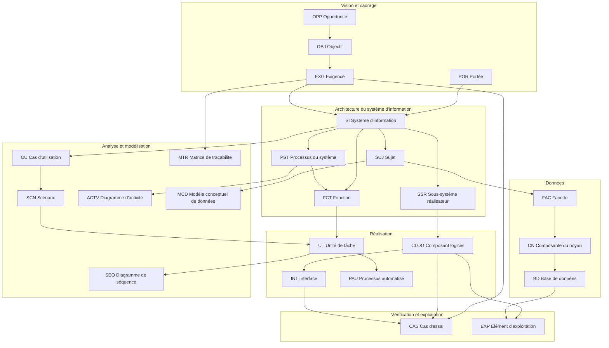
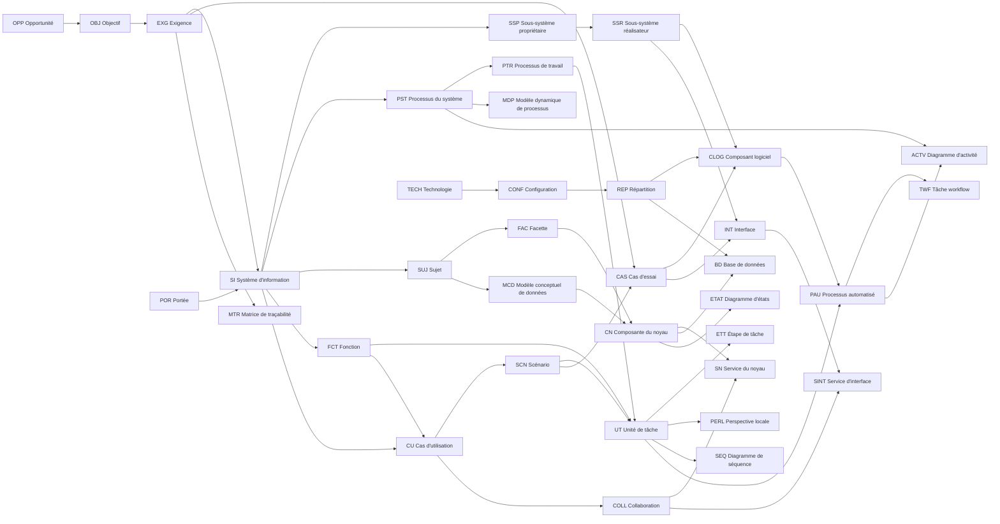

# Métamodèle d'information Macroscope

## 1. Objet

Ce document décrit les principaux concepts d'information Macroscope utiles pour relier les livrables de cadrage, d'architecture, de spécification, de réalisation, d'essai, d'implantation et d'exploitation.

Le métamodèle ne remplace pas les livrables Macroscope. Il sert de carte de cohérence pour comprendre quels objets sont documentés, comment ils se relient et quels livrables les portent.

TOGAF a préséance sur Macroscope. Les concepts ci-dessous doivent donc être utilisés comme artefacts, vues spécialisées ou annexes alimentant notamment le Document de définition d'architecture, la Spécification des exigences d'architecture, les vues d'architecture, les plans de migration et les éléments de gouvernance de mise en œuvre.

## Diagramme de contexte

## 2. Sources consultées

### Références internes principales

| Source | Apport au métamodèle |
| --- | --- |
| `skills/INDEX.md` | Codes et noms des skills Macroscope actives. |
| `skills/macroscope-p2863-exigences/references/LIVRABLE.md` | Définition du rôle des exigences et des points de vue propriétaire, utilisateur et réalisateur. |
| `skills/macroscope-p200s-structure-proprietaire-du-systeme/references/LIVRABLE.md` | Concepts de structure propriétaire : système d'information, sujets, sous-systèmes et fonctions. |
| `skills/macroscope-p201s-processus-du-systeme/references/LIVRABLE.md` | Concepts de dynamique propriétaire : processus du système, dépendances, participants et répartition. |
| `skills/macroscope-p170s-structure-de-linformation/references/LIVRABLE.md` | Concepts de structure de l'information : facette, composante du noyau, association. |
| `skills/macroscope-p150o-sujet/references/LIVRABLE.md` | Décomposition d'un sujet en facettes et relations entre facettes. |
| `skills/macroscope-p180s-specifications-de-composante-du-noyau/references/LIVRABLE.md` | Spécification des services d'une composante du noyau. |
| `skills/macroscope-p250s-structure-utilisateur-du-systeme/references/LIVRABLE.md` | Concepts utilisateur : fonction, unité de tâche, interface utilisateur. |
| `skills/macroscope-p251s-processus-de-travail/references/LIVRABLE.md` | Processus de travail, unités de tâche, participants et contextes d'utilisation. |
| `skills/macroscope-p251u-processus-de-travail-utilisateur/references/LIVRABLE.md` | Définition détaillée des unités de tâche composant un processus de travail. |
| `skills/macroscope-p219s-architecture-logicielle/references/LIVRABLE.md` | Sous-systèmes réalisateur, composants logiciels et interfaces. |
| `skills/macroscope-p219c-sous-systeme-niveau-realisateur/references/LIVRABLE.md` | Composants logiciels d'un sous-système réalisateur. |
| `skills/macroscope-p229c-interfaces-du-sous-systeme-niveau-realisateur/references/LIVRABLE.md` | Services et protocoles offerts par une interface de sous-système réalisateur. |
| `skills/macroscope-p2871-specifications-du-systeme/references/LIVRABLE.md` | Passage de l'architecture aux spécifications réalisables. |
| `skills/macroscope-p555s-specifications-de-composant-logiciel/references/LIVRABLE.md` | Classes, modules et interfaces d'un composant logiciel. |
| `skills/macroscope-p580s-specifications-de-processus-automatise/references/LIVRABLE.md` | Processus automatisé, chaîne de production, workflow, travaux et tâches. |
| `skills/macroscope-p510s-structure-de-linformation-persistante/references/LIVRABLE.md` | Base de données, modèle physique, répartition et réplication. |
| `skills/macroscope-p269s-technologie-et-repartition-utilisateur/references/LIVRABLE.md` | Infrastructure technologique, configuration utilisateur et répartition. |
| `skills/macroscope-p900s-suivi-des-exigences/references/LIVRABLE.md` | Traçabilité entre exigences, architecture, spécifications et composantes du système. |
| `cadre-architecutre.md` | Vues d'architecture, transfert vers la réalisation et liens TOGAF. |
| `approche-documentation.md` | Chaîne de passage entre vision, architecture, réalisation, implantation et exploitation. |

## 3. Règles d'interprétation

- Un concept Macroscope représente un objet d'information documenté par un ou plusieurs livrables.
- Les niveaux propriétaire, utilisateur et réalisateur sont des points de vue sur le système d'information, pas des priorités méthodologiques.
- Les relations indiquées sont des relations de documentation et de traçabilité; elles ne constituent pas automatiquement un modèle de données physique.
- Les exigences, décisions, contraintes et critères d'acceptation doivent rester traçables jusqu'aux processus, données, composants, interfaces, essais et éléments d'exploitation.
- Les concepts TOGAF équivalents sont indicatifs et doivent être adaptés au contexte de l'organisation.

## 4. Concepts principaux

| Code | Nom | Description | Relations principales | Livrables sources |
| --- | --- | --- | --- | --- |
| `OPP` | Opportunité | Motivation d'affaires ou occasion d'amélioration qui justifie l'analyse d'un changement. | Oriente `OBJ`; motive `EXG`; peut être cadrée par `POR`. | `P100S`, `P2863`, `M002A` |
| `OBJ` | Objectif du système d'information | Résultat attendu ou cible que le système d'information doit soutenir. | Est réalisé par `SI`; justifie `EXG`; sert de base aux critères d'acceptation. | `P130O`, `P2863`, `P900S` |
| `POR` | Portée du système d'information | Limites, inclusions, exclusions et dépendances du système visé. | Délimite `SI`, `PST`, `SUJ`, `FCT`, `SSR`, `TECH`; encadre `EXG`. | `P140O`, `P200A`, `P2863` |
| `EXG` | Exigence | Besoin vérifiable exprimé indépendamment d'une solution particulière. | Dérive de `OBJ`; contraint `SI`; se trace vers `PST`, `SUJ`, `FCT`, `UT`, `SSR`, `CLOG`, `INT`, `CAS`. | `P140S`, `P2863`, `P900S` |
| `DEC` | Décision | Choix retenu pour orienter l'architecture, la conception, la réalisation ou l'exploitation. | Répond à `EXG`; influence `PRN`, `ORI`, `SSR`, `TECH`, `REP`; doit être justifiée. | `P200A`, `P900S`, comptes rendus |
| `ORI` | Orientation | Direction retenue pour répondre aux objectifs, aspects critiques et contraintes. | Se décline en `PRN` et règles; influence la structure, la dynamique et la technologie. | `P230S`, `P231S`, `P2863` |
| `PRN` | Principe | Règle directrice appliquée au niveau propriétaire, utilisateur ou réalisateur. | Encadre les décisions; contraint `FCT`, `SSR`, `CLOG`, `TECH` et `REP`. | `P165O`, `P240S`, `P240U`, `P261S` |
| `SI` | Système d'information | Ensemble ciblé de données, traitements, ressources, interfaces, technologie et règles servant une portée donnée. | Est délimité par `POR`; répond à `OBJ` et `EXG`; se décrit par `SSP`, `SUJ`, `PST`, `FCT`, `SSR`, `TECH`. | `P140O`, `P200S`, `P201S`, `P250S`, `P2867` |
| `VUE` | Vue d'architecture | Représentation cohérente du système selon un angle métier, données, applicatif, technologique, sécurité ou exploitation. | Regroupe des concepts; soutient la traçabilité TOGAF; est alimentée par plusieurs livrables Macroscope. | `P200A`, `cadre-architecutre.md` |
| `CU` | Cas d'utilisation | Artefact d'analyse décrivant comment un acteur atteint un résultat attendu avec le système. Dans Macroscope, il est surtout utilisé dans les techniques orientées objet et dans la définition de la portée. | Implique `ACT`; décrit ou regroupe `UT`; se décline en `SCN`; aide à identifier `SN`, `SINT`, `COLL` et `CAS`. | `P-OO-SC`, `P-OO-UC`, `P490S`, `P250U`, `P251U` |
| `SCN` | Scénario | Parcours concret, nominal ou alternatif, décrivant une séquence d'interactions dans un cas d'utilisation, une unité de tâche ou un essai. | Spécialise `CU` ou `UT`; se détaille en `ETT`; alimente `SEQ`, `ACTV` et `CAS`. | `P490S`, `P487S`, `P750S`, `P-OO-UC` |
| `SEQ` | Diagramme de séquence | Diagramme comportemental représentant les messages échangés entre participants dans le temps. | Illustre `SCN`, `UT`, `ETT`, `SN`, `SINT`, `CLOG` ou `INT`; utilise `PART`. | `P490S`, `P540S`, `P12744` |
| `ACTV` | Diagramme d'activité | Diagramme comportemental représentant un flux d'activités, de décisions, de parallélismes ou de responsabilités. | Illustre `PST`, `PTR`, `UT`, `PAU` ou `TWF`; peut préparer les scénarios et cas d'essai. | `P490S`, `P12744`, `P580S` |
| `ETAT` | Diagramme d'états | Diagramme comportemental représentant les états possibles d'un objet, participant, composante ou processus. | Décrit les états de `CN`, `PART`, `CLOG`, `PAU` ou `UT`; aide à repérer règles, événements et transitions. | `P12744`, `P-OO-UH`, `P490S` |
| `COLL` | Collaboration | Artefact décrivant les objets, services, composants ou participants qui coopèrent pour exécuter une tâche ou un service. | Relie `PART`, `CN`, `SN`, `SINT`, `CLOG` et `INT`; peut être illustrée par `SEQ`. | `P-DP-UC`, `P-OO-UC`, `P490S` |
| `PERL` | Perspective locale | Vue détaillée centrée sur une unité de tâche, une étape de tâche ou un service pour montrer les interactions et responsabilités locales. | Précise `UT`, `ETT`, `SN` ou `SINT`; documente `PART`, `COLL` et messages. | `P490S`, `P487S`, `P180S`, `P186S` |
| `MDP` | Modèle dynamique de processus | Représentation dynamique d'un processus sous forme d'événements, participants, relations opérationnelles et relations de préséance. | Décrit `PST`, `PTR`, `EVT` et `PART`; soutient l'analyse des dépendances et enchaînements. | `P201O`, `P201S`, livrables `PX000` |
| `MTR` | Matrice de traçabilité | Artefact de contrôle reliant exigences, décisions, concepts d'architecture, composants, interfaces, essais et exploitation. | Trace `EXG`, `DEC`, `PST`, `SUJ`, `UT`, `SSR`, `CLOG`, `INT`, `CAS` et `EXP`. | `P900S`, `cadre-architecutre.md`, `approche-documentation.md` |
| `MCD` | Modèle conceptuel de données | Artefact de modélisation des concepts d'information, entités, relations et associations au niveau logique ou conceptuel. | Représente `SUJ`, `FAC`, `CN` et leurs associations; alimente `BD` sans se confondre avec le modèle physique. | `P150O`, `P170S`, `P150C`, `P510S` |
| `SSP` | Sous-système propriétaire | Découpage des traitements du système au niveau propriétaire. | Appartient à `SI`; regroupe ou expose des `FCT`; interagit avec `SUJ` et `PST`; est raffiné par `SSR`. | `P200S`, `P200O` |
| `PST` | Processus du système | Processus de haut niveau décrivant la dynamique du système d'information du point de vue propriétaire. | Appartient à `SI`; s'enchaîne avec d'autres `PST`; implique `PART`; utilise ou transforme `SUJ` et `FAC`; se raffine en `PTR`. | `P201S`, `P201O` |
| `PTR` | Processus de travail | Processus exécuté par l'utilisateur pour produire un produit ou un service, incluant des unités de tâche automatisées ou manuelles. | Raffine `PST`; contient `UT`; implique `ACT` ou `PART`; peut être soutenu par `FCT` et `IHM`. | `P251S`, `P251U` |
| `FCT` | Fonction | Regroupement de traitements présenté au niveau utilisateur. | Appartient à la structure utilisateur du `SI`; contient des `UT`; est liée à des `EXG`, `PST`, `PTR`, `SUJ` et `IHM`. | `P250S`, `P250U` |
| `UT` | Unité de tâche | Unité de travail utilisateur, automatisée ou manuelle, composant une fonction ou un processus de travail. | Appartient à `FCT` ou `PTR`; se détaille en `ETT`; manipule `SUJ`, `FAC` ou `CN`; peut être spécifiée par `P490S`. | `P250U`, `P251S`, `P251U`, `P490S` |
| `ETT` | Étape de tâche | Étape détaillée d'une unité de tâche ou d'un scénario d'interaction. | Appartient à `UT`; échange des messages avec `PART`, `CLOG`, `IHM` ou `INT`; sert aux scénarios et cas d'essai. | `P487S`, `P490S` |
| `ACT` | Acteur ou ressource utilisateur | Personne, rôle, groupe ou système externe participant à l'utilisation du système. | Participe à `PTR`, `UT` et `IHM`; peut être client, fournisseur ou ressource interne. | `P239U`, `P251S`, `P251U` |
| `PART` | Participant | Objet, ressource ou entité participant à un processus ou à une interaction. | Interagit dans `PST`, `PTR`, `UT` ou un diagramme de séquence; peut correspondre à `ACT`, `SUJ`, `CN`, `CLOG` ou `INT`. | `P201S`, `P490S`, livrables `PX000` |
| `EVT` | Événement | Stimulus ou résultat déclenchant ou jalonnant un processus. | Déclenche `PST`, `PTR`, `PAU` ou `UT`; peut établir la préséance entre processus. | `P201O`, livrables `PX000`, `P580S` |
| `SUJ` | Sujet | Domaine d'information impliqué dans le système, décrit au niveau propriétaire. | Appartient à `SI`; se décompose en `FAC`; est utilisé par `PST`, `FCT`, `UT`; alimente la vue données TOGAF. | `P150O`, `P200S`, `P170S` |
| `FAC` | Facette | Angle ou regroupement d'information à l'intérieur d'un sujet. | Appartient à `SUJ`; contient des `CN`; possède des relations avec d'autres `FAC`; participe à `PST`. | `P150O`, `P170S` |
| `CN` | Composante du noyau | Classe, association, entité ou relation représentant une composante d'information au noyau. | Appartient à `FAC`; expose des `SN`; peut être persistée dans `BD`; est manipulée par `UT`, `PAU` ou `CLOG`. | `P170S`, `P180S` |
| `SN` | Service du noyau | Service offert par une composante du noyau. | Appartient à `CN`; peut être invoqué par `UT`, `CLOG`, `SSR` ou `INT`. | `P180S`, `P490S` |
| `BD` | Base de données | Structure persistante servant à l'implantation de l'information du système. | Implante des `CN`, classes, relations ou entités; possède une répartition, une réplication et des optimisations. | `P150C`, `P510S`, `P510C` |
| `SSR` | Sous-système réalisateur | Découpage logiciel applicatif du système au niveau réalisateur. | Raffine `SSP` ou soutient `FCT`; contient `CLOG`; expose `INT`; répond à `EXG` et `DEC`. | `P219S`, `P219C` |
| `CLOG` | Composant logiciel | Composant de réalisation constitué de classes, modules ou interfaces selon l'approche de modélisation. | Appartient à `SSR`; implémente `UT`, `PAU`, `SN` ou règles; expose ou consomme `INT`; est vérifié par `CAS`. | `P555S`, `P555C`, `P2875` |
| `CLSR` | Classe niveau réalisateur | Classe logicielle détaillant la réalisation orientée objet. | Appartient à `CLOG`; réalise des comportements, services ou accès aux données; peut correspondre à `CN`. | `P555S`, `P540S` |
| `MOD` | Module | Élément logiciel dans une modélisation traditionnelle données-processus. | Appartient à `CLOG`; réalise des traitements; peut être lié à une configuration technologique. | `P555S` |
| `INT` | Interface | Point d'accès ou contrat de communication entre sous-systèmes, composants ou systèmes. | Est exposée par `SSR` ou `CLOG`; offre des `SINT`; utilise un `PROT`; soutient intégrations et essais. | `P229C`, `P555S`, `P560C` |
| `SINT` | Service d'interface | Service offert par une interface de sous-système ou de composant. | Appartient à `INT`; peut invoquer `CLOG`, `SN`, `PAU` ou accès à `BD`. | `P229C`, `P560C` |
| `PROT` | Protocole de communication | Règle technique de communication applicable à une interface. | Contraint `INT` et `SINT`; dépend de `TECH` et `REP`. | `P229C`, `P269S` |
| `IHM` | Interface utilisateur | Ensemble des éléments de navigation et catégories d'interface visibles par l'utilisateur. | Soutient `FCT` et `UT`; se décrit par `NAV` et `CUI`; dépend des clientèles et environnements d'utilisation. | `P250S`, `P176U`, `P251S` |
| `NAV` | Navigation | Organisation des parcours d'interface utilisateur. | Appartient à `IHM`; relie `FCT`, `UT` et catégories d'interface. | `P250S` |
| `CUI` | Catégorie d'interface utilisateur | Regroupement d'interfaces utilisateur selon leur rôle ou comportement. | Appartient à `IHM`; soutient des `UT`; peut être associée à des règles d'interface. | `P176U`, `P250S` |
| `PAU` | Processus automatisé | Chaîne de production entièrement automatisée ou workflow contrôlé par le système. | Réalise ou soutient `PTR` et `UT`; contient `TWF`; utilise `CLOG`, `INT`, `BD` et `TECH`. | `P580S`, `P580U`, `P581U` |
| `TWF` | Travail ou tâche de workflow | Étape d'une chaîne ou tâche d'un processus automatisé. | Appartient à `PAU`; consomme ou produit des données; peut appeler `CLOG` ou `INT`. | `P580S` |
| `TECH` | Technologie | Composante ou capacité d'infrastructure requise par le système. | Supporte `SI`, `SSR`, `CLOG`, `BD`, `IHM` et `PAU`; influence `CONF` et `REP`. | `P268U`, `P269S` |
| `CONF` | Configuration technologique | Agencement d'infrastructure requis pour une utilisation ou une réalisation donnée. | Regroupe des `TECH`; supporte `IHM`, `CLOG`, `BD` ou `PAU`; peut varier par clientèle ou environnement. | `P269S`, `P268U` |
| `REP` | Répartition | Allocation de ressources, données, processus ou composantes dans l'organisation ou l'infrastructure. | S'applique à `PST`, `FAC`, `BD`, `TECH`, `CLOG`; dépend du point de vue propriétaire, utilisateur ou réalisateur. | `P269O`, `P269U`, `P269S`, `P510S` |
| `CAS` | Cas d'essai | Condition ou scénario permettant de vérifier une exigence, un processus, une interface ou un composant. | Vérifie `EXG`, `UT`, `PAU`, `CLOG`, `INT`, `BD`; alimente les résultats d'essai. | `P750S`, `P750A`, `P770S`, `P900S` |
| `EXP` | Élément d'exploitation | Procédure, instruction, niveau de service ou contrainte d'exploitation. | Supporte `SI`, `TECH`, `BD`, `CLOG`, `PAU`; se relie aux exigences de disponibilité, soutien et maintenance. | `P705S`, `P720C`, `P931G`, `P950S` |

## 5. Relations de référence

| Relation | Sens | Description | Sources |
| --- | --- | --- | --- |
| `OPP -> OBJ` | justifie | Une opportunité motive des objectifs de système d'information. | `P2863`, `cadre-architecutre.md` |
| `OBJ -> EXG` | dérive | Les objectifs se traduisent en exigences vérifiables. | `P2863`, `P900S` |
| `EXG -> MTR` | est tracée par | Les exigences sont reliées aux décisions, processus, données, composants, interfaces, essais et éléments d'exploitation dans une matrice de traçabilité. | `P900S`, `cadre-architecutre.md` |
| `POR -> SI` | délimite | La portée précise ce qui est inclus ou exclu du système d'information. | `P140O`, `P200S` |
| `POR -> CU` | identifie | La définition de la portée peut identifier des cas d'utilisation de niveau propriétaire. | `P-OO-SC` |
| `SI -> SSP` | se décompose au niveau propriétaire | Le système est structuré en sous-systèmes et fonctions du point de vue propriétaire. | `P200S` |
| `SI -> SUJ` | comprend | Le système inclut des sujets d'information. | `P200S`, `P150O` |
| `SI -> PST` | est décrit dynamiquement par | Le système est représenté par des processus de haut niveau et leurs dépendances. | `P201S` |
| `SUJ -> FAC` | se décompose en | Un sujet est décrit par ses facettes. | `P150O`, `P170S` |
| `SUJ -> MCD` | est représenté dans | Les sujets et leurs relations peuvent être représentés dans un modèle conceptuel de données. | `P150O`, `P170S` |
| `FAC -> CN` | contient | Une facette contient des composantes du noyau, comme classes, associations, entités ou relations. | `P170S` |
| `MCD -> CN` | représente | Le modèle conceptuel de données représente les composantes d'information et leurs associations. | `P170S`, `P150C` |
| `CN -> SN` | expose | Une composante du noyau offre des services. | `P180S` |
| `PST -> PTR` | se raffine en | Un processus du système peut être détaillé en processus de travail. | `P201S`, `P251S` |
| `PTR -> UT` | contient | Un processus de travail est composé d'unités de tâche. | `P251S`, `P251U` |
| `FCT -> UT` | contient | Une fonction est détaillée par des unités de tâche. | `P250S`, `P250U` |
| `FCT -> CU` | regroupe | Une fonction ou un sous-système peut regrouper des cas d'utilisation liés sur le plan fonctionnel. | `P-OO-UO`, `P-OO-UC` |
| `CU -> UT` | décrit ou regroupe | Un cas d'utilisation décrit ou regroupe des unités de tâche et sert à les analyser. | `P-OO-UC`, `P490S` |
| `CU -> SCN` | se décline en | Un cas d'utilisation peut être exprimé par des scénarios nominaux, alternatifs ou d'exception. | `P-OO-UC`, `P490S` |
| `SCN -> CAS` | alimente | Les scénarios peuvent être transformés en cas d'essai ou critères d'acceptation. | `P490S`, `P750S` |
| `UT -> ETT` | se détaille en | Une unité de tâche peut être décrite par des étapes ou scénarios d'interaction. | `P490S`, `P487S` |
| `UT -> PERL` | est détaillée par | La perspective locale décrit les interactions et responsabilités autour d'une unité de tâche ou étape. | `P490S`, `P487S` |
| `UT -> SEQ` | peut être illustrée par | Une unité de tâche peut être représentée par un diagramme de séquence. | `P490S` |
| `PST -> MDP` | est modélisé par | Le modèle dynamique de processus représente les événements, participants et relations de préséance d'un processus. | `P201O`, livrables `PX000` |
| `PST -> ACTV` | peut être illustré par | Un processus peut être représenté par un diagramme d'activité. | `P12744`, `P580S` |
| `PTR -> ACT` | implique | Un processus de travail implique des clientèles, ressources ou participants. | `P251S`, `P239U` |
| `PST -> PART` | implique | Un processus du système fait intervenir des participants. | `P201S` |
| `EVT -> PST` | déclenche ou jalonne | Les événements déclenchent ou séquencent des processus. | `P201O`, livrables `PX000` |
| `SI -> FCT` | offre | La structure utilisateur présente les fonctions du système. | `P250S` |
| `FCT -> IHM` | est soutenue par | Les fonctions sont accessibles ou soutenues par l'interface utilisateur. | `P250S` |
| `IHM -> NAV` | organise | L'interface utilisateur comprend des parcours de navigation. | `P250S` |
| `IHM -> CUI` | classe | L'interface utilisateur peut être décrite par catégories. | `P176U`, `P250S` |
| `SSP -> SSR` | est raffiné par | Un découpage propriétaire peut être détaillé au niveau réalisateur par des sous-systèmes logiciels. | `P200S`, `P219S` |
| `SSR -> CLOG` | contient | Un sous-système réalisateur contient des composants logiciels. | `P219S`, `P219C` |
| `SSR -> INT` | expose | Un sous-système réalisateur présente des interfaces. | `P219S`, `P229C` |
| `INT -> SINT` | offre | Une interface offre des services. | `P229C` |
| `INT -> PROT` | est contrainte par | Une interface applique un protocole de communication. | `P229C` |
| `COLL -> SN` | identifie | L'analyse des collaborations aide à identifier les services du noyau nécessaires. | `P-DP-UC`, `P-OO-UC` |
| `COLL -> SINT` | identifie | L'analyse des collaborations aide à identifier les services d'interface nécessaires. | `P-DP-UC`, `P-OO-UC` |
| `CLOG -> CLSR` | contient | Un composant logiciel orienté objet contient des classes ou interfaces. | `P555S` |
| `CLOG -> MOD` | contient | Un composant logiciel traditionnel contient des modules. | `P555S` |
| `PAU -> TWF` | contient | Un processus automatisé comprend des travaux ou tâches de workflow. | `P580S` |
| `PAU -> ACTV` | peut être illustré par | Un processus automatisé ou workflow peut être représenté par un flux d'activités. | `P580S`, `P12744` |
| `CN -> ETAT` | peut être décrit par | Un objet d'information peut avoir des états et transitions utiles à documenter. | `P12744`, `P-OO-UH` |
| `CN -> BD` | est persistée dans | Les composantes d'information peuvent être implantées dans des bases de données. | `P510S`, `P150C` |
| `TECH -> CONF` | compose | Les technologies forment des configurations d'infrastructure. | `P269S`, `P268U` |
| `REP -> TECH` | alloue | La répartition précise où les ressources ou technologies sont placées. | `P269S`, `P269U` |
| `EXG -> CAS` | est vérifiée par | Les exigences doivent être vérifiables par des cas ou résultats d'essai. | `P900S`, `P750S`, `P770S` |
| `EXG -> CLOG` | est implantée par | Le suivi des exigences relie les exigences aux composantes chargées de leur implantation. | `P900S` |
| `EXG -> INT` | contraint | Les exigences peuvent porter sur des interfaces ou intégrations. | `P900S`, `P229C` |
| `EXG -> EXP` | contraint | Les exigences peuvent porter sur l'exploitation, le soutien ou les niveaux de service. | `P900S`, `P705S`, `P931G` |

## 6. Vue synthétique

## 7. Correspondances TOGAF

| Domaine TOGAF | Concepts Macroscope alignés | Livrables Macroscope typiques | Usage attendu |
| --- | --- | --- | --- |
| Vision d'architecture | `OPP`, `OBJ`, `POR`, `EXG`, `DEC` | `P100S`, `P130O`, `P140O`, `P2863`, `P900S` | Cadrer la demande, la valeur, la portée et les exigences initiales. |
| Architecture métier | `PST`, `PTR`, `FCT`, `UT`, `ACT`, `EVT`, `PAU`, `CU`, `SCN`, `ACTV`, `MDP` | `P201S`, `P251S`, `P250S`, `P580S`, `P-OO-UC`, `P490S` | Décrire les processus, usages, responsabilités et enchaînements de travail. |
| Architecture des données | `SUJ`, `FAC`, `CN`, `SN`, `BD`, `MCD` | `P150O`, `P170S`, `P180S`, `P150C`, `P510S` | Décrire les concepts d'information, leurs associations et leur persistance. |
| Architecture applicative | `SSR`, `CLOG`, `CLSR`, `MOD`, `INT`, `SINT`, `PROT` | `P219S`, `P219C`, `P229C`, `P555S`, `P560C` | Décrire les sous-systèmes, composants, interfaces et services applicatifs. |
| Architecture technologique | `TECH`, `CONF`, `REP` | `P268U`, `P269S`, `P269U`, `P269O` | Décrire l'infrastructure, les configurations et la répartition. |
| Gouvernance de mise en œuvre | `CAS`, `EXP`, `DEC`, `EXG`, `MTR`, `SEQ`, `ETAT`, `COLL`, `PERL` | `P750S`, `P770S`, `P705S`, `P931G`, `P900S`, `P490S` | Vérifier la conformité, préparer l'exploitation et maintenir la traçabilité. |

## 8. Matrice de traçabilité recommandée

| Élément source | Élément cible | Relation à documenter | Exemple |
| --- | --- | --- | --- |
| `OBJ` | `EXG` | L'objectif est décliné en exigences vérifiables. | `OBJ-001 -> EXG-001` |
| `EXG` | `PST`, `PTR`, `FCT`, `UT` | L'exigence touche un processus ou un usage. | `EXG-014 -> UT-003` |
| `CU`, `SCN` | `UT`, `ETT`, `CAS` | Le cas d'utilisation et ses scénarios détaillent les comportements attendus et préparent les essais. | `CU-002 -> SCN-002-A -> CAS-002-A` |
| `EXG` | `SUJ`, `FAC`, `CN`, `BD` | L'exigence touche des informations ou leur persistance. | `EXG-021 -> CN-Client` |
| `MCD` | `SUJ`, `FAC`, `CN`, `BD` | Le modèle conceptuel relie les concepts d'information à leur implantation persistante. | `MCD-Client -> BD-Client` |
| `EXG` | `SSR`, `CLOG`, `INT` | L'exigence est implantée par une composante ou interface. | `EXG-032 -> INT-Paiement` |
| `DEC` | `PRN`, `TECH`, `REP` | La décision impose un principe, une technologie ou une répartition. | `DEC-007 -> TECH-API-Gateway` |
| `UT` | `CLOG`, `INT`, `PAU` | L'unité de tâche est réalisée par des composants, interfaces ou traitements automatisés. | `UT-005 -> CLOG-Validation` |
| `PERL`, `SEQ`, `COLL` | `SN`, `SINT`, `CLOG`, `INT` | Les vues d'interaction détaillent les services et composants requis. | `SEQ-UT-005 -> SINT-Rechercher` |
| `EXG` | `CAS` | L'exigence est vérifiée par un cas d'essai. | `EXG-014 -> CAS-014-A` |
| `CLOG`, `INT`, `BD` | `EXP` | L'élément réalisé possède des contraintes d'exploitation. | `CLOG-Import -> EXP-Surveillance` |

## 9. Hypothèses retenues

- Les codes courts du présent document sont des codes de métamodèle internes au dépôt; ils ne prétendent pas remplacer les codes officiels de livrables Macroscope.
- `SSP` est utilisé pour désigner un sous-système au niveau propriétaire, conformément à l'exemple fourni et à la description de `P200S`.
- `SSR` est utilisé pour distinguer le sous-système de niveau réalisateur du sous-système propriétaire.
- Les concepts `DEC`, `VUE`, `CAS`, `EXP`, `CU`, `SCN`, `SEQ`, `ACTV`, `ETAT`, `COLL`, `PERL`, `MDP`, `MTR` et `MCD` sont inclus parce qu'ils sont nécessaires à l'analyse, à la modélisation, à la traçabilité TOGAF et au passage vers la réalisation, même s'ils ne correspondent pas toujours à un seul livrable Macroscope.
- Les relations sont exprimées au niveau logique de documentation. Elles doivent être spécialisées par projet avant d'être utilisées comme modèle de données, ontologie ou schéma d'outil.

## 10. Points à confirmer

- Confirmer si les codes courts doivent être normalisés selon une nomenclature officielle Macroscope, si elle existe dans d'autres sources.
- Confirmer si les concepts de sécurité, gestion de configuration, changement organisationnel, formation et exploitation doivent être détaillés au même niveau que les concepts métier, données et applicatifs.
- Confirmer si le dépôt doit conserver ce métamodèle comme référence racine ou le déplacer vers `references/`.
- Confirmer si une représentation machine doit être ajoutée ultérieurement, par exemple en YAML, JSON Schema, RDF/OWL ou Mermaid enrichi.
